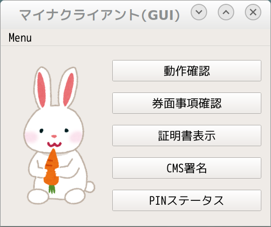

myna - マイナンバーカード・ユーティリティ
==============================================

## サポートOS

- Windows
- OS X
- Linux
- FreeBSD

## ダウンロード

<https://github.com/jpki/myna/releases>

## 使い方

詳しくは `myna --help` や myna `サブコマンド --help` `孫コマンド --help` を実行してください。

~~~
Usage:
  myna [command]

  Available Commands:
    card        券面APおよび券面事項入力補助AP
    jpki        公的個人認証関連コマンド
    pin         PIN関連操作
    test        リーダーの動作確認
    help        Help about any command
~~~

### 4属性を取得

~~~
$ myna card attr
~~~

### PINのステータスを確認

~~~
$ myna pin status
~~~

### JPKI認証用証明書を取得

~~~
$ myna jpki cert auth
~~~

### JPKI署名用証明書を取得

~~~
$ myna jpki cert sign
~~~

### JPKI署名用証明書でCMS署名

~~~
$ myna jpki cms sign -i 署名対象ファイル -o 署名ファイル
~~~

### JPKI署名用CA証明書でCMS署名を検証

~~~
$ myna jpki cms verify 署名ファイル
~~~

OpenSSLコマンドで検証

~~~
$ openssl cms -verify -CAfile 署名用CA証明書 -inform der -in 署名ファイル
~~~

## GUI版もあるよ

## ビルド環境

golang 1.7 or later

## mynaコマンドのビルド・インストール

~~~
% go get -u github.com/jpki/myna
~~~

### 依存パッケージのインストール

- Debian/Ubuntu

~~~
# apt-get install libpcsclite-dev
~~~

- RHEL/CentOS

~~~
# yum install pcsc-lite-devel
~~~

- Windows

~~~
PS> choco install -y git golang
~~~

- OSX

- FreeBSD

~~~
# pkg install pcsc-lite ccid pkgconf
~~~
