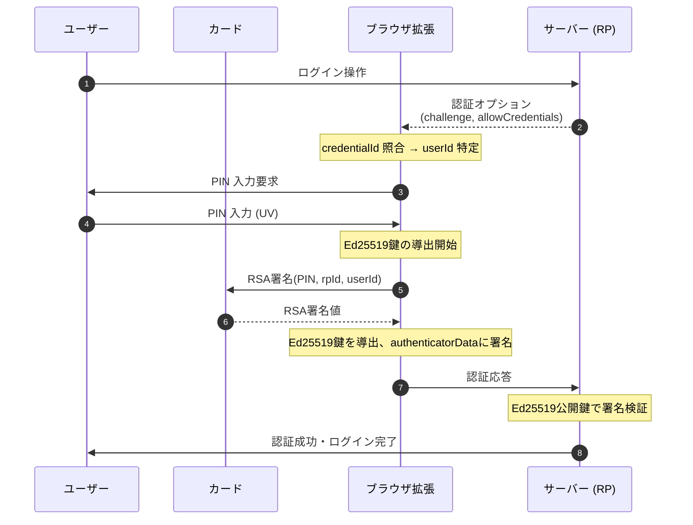

# マイナンバーカードをFIDO2デバイスにする試み

## 概要
パスキーはスマホを無くしたら詰んでしまう。という所がよく心配されます。
2台目のスマホやFIDO2認証器を登録しておけば安心なのですが、
普通はスマホを何台も持っていないし、FIDOキーはなおさら持っている人は少ないです。
誰でも持っているマイナンバーカードをFIDOデバイスとして登録しておけば
スマホ紛失に対するリカバリー対策になるかもしれません。

証明書の更新やカードに穴を空けられてしまうという欠点はありますが、
無くしたと言って(お金を支払い)保有し続けることは可能です。

## 認証シーケンス

allowCredentials指定ありの最もシンプルなケース

